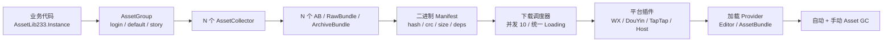

# AssetLib233-unity

独立 Unity / 团结引擎资源热更库。

文档首页: https://neko233-com.github.io/AssetLib233-unity/

仓库: https://github.com/neko233-com/AssetLib233-unity

目标：完全替代 YooAsset，优先服务微信小游戏 / WebGL / HybridCLR / 多 AssetGroup 热更场景。框架本体 0 依赖；UniTask 为可选插件。CDN 发布不内置在核心库里，项目继续使用自己的上传、刷新、预热链路。

## 安装

UPM Git 一行安装：

```text
https://github.com/neko233-com/AssetLib233-unity.git
```

无 Git 导入，一行 PowerShell 下载到当前 Unity 项目：

```powershell
powershell -ExecutionPolicy Bypass -Command "iwr https://raw.githubusercontent.com/neko233-com/AssetLib233-unity/main/Tools/install-assetlib233.ps1 -OutFile $env:TEMP/install-assetlib233.ps1; & $env:TEMP/install-assetlib233.ps1 -ProjectRoot (Get-Location).Path"
```

核心模型：



- `AssetLib233.Instance`: 用户 facade 单例。
- `AssetGroup`: 顶层热更资源组。
- `AssetCollector`: 一个资源组内的收集器，决定资源如何切成 AB / RawBundle / ArchiveBundle。
- `AssetManifest`: 二进制清单，保存地址、标签、依赖、hash、crc、size。
- `Plugin_MiniGame_WX` / `Plugin_MiniGame_DouYin` / `Plugin_MiniGame_TapTap`: 小游戏平台插件，均由 asmdef `defineConstraints` 宏控制；未定义对应平台宏时不会参与编译和打包。
- `Plugin_UniTask`: UniTask 扩展，Runtime 不强依赖 UniTask。
- `AssetLib233StartupPlan`: 一个 login 快速首组 + 登录后 N 个 AssetGroup。
- `AssetLib233AssetGcService`: 自动 Asset GC + 手动 Asset GC。
- `Plugin_CDN_Deploy`: 可选 CDN 发布插件，默认不编译；需要时定义 `ASSETLIB233_CDN_DEPLOY` 后使用。
- `AssetLib233DownloadScheduler`: 单文件下载 + 多 AssetGroup 并发下载 + 统一 Loading。
- `IAssetLib233BuildCompressionStrategy`: 压缩策略接口。
- `IAssetLib233BuildPackRule`: 打包规则接口。
- `IAssetLib233BuildVerifier`: 打包产物校验接口，确认 AB / Manifest / hash / size 完整。
- `AssetLib233EditorBuildReportWindow`: 构建后自动弹出报告，支持复制排障文本。
- `IAssetLib233EditorBuildNotifier`: 构建通知扩展点，内置飞书 webhook 支持。
- `AssetLib233ObsoleteBundleCleaner`: 清理新版本不再使用的废弃 AB。
- `AssetLib233PreparePackageOperation`: `.version -> .manifest -> Manifest 注入` 主线程异步流程。
- `AssetLib233PackageDownloadOperation`: Manifest 就绪后全量 / tag 下载到本地 cache。
- `AssetController_AssetLib233`: 当前项目 `AssetManager233` 默认后端，业务代码不用改加载入口。

小游戏插件宏：

| 插件 | 编译宏 |
|---|---|
| `Plugin_MiniGame_WX` | `WX`，兼容 `WEIXINMINIGAME` |
| `Plugin_MiniGame_TapTap` | `TAPMINIGAME`，兼容 `TAPTAP` |
| `Plugin_MiniGame_DouYin` | `DOUYINMINIGAME`，兼容 `DOUYIN` / `TT` |

推荐项目只维护每个平台的主宏，构建工具可以额外补历史别名；AssetLib233 插件会按宏自动注册平台能力。

## 快速示例

```csharp
AssetLib233PackageConfig config = new AssetLib233PackageConfig();
config.PackageName = "default";
config.PlayMode = EnumHotUpdateType.Host;
config.DefaultHostServer = "https://cdn.example.com/default";
config.FallbackHostServer = "https://backup.example.com/default";
config.EnableBundleCrypto = true;
config.BundleCryptoPassword = "root";

AssetLib233.Instance.Initialize();
AssetLib233.Instance.InitializeGroup(config);

AssetHandle233<GameObject> handle =
    AssetLib233.Instance.LoadAssetAsync<GameObject>("default", "main");
```

## 异步支持

- callback: `operation.OnCompleted(...)`
- C# await: `await operation`
- UniTask: `await operation.ToUniTask()`

## 文档

纯 HTML 文档位于 `docs/`，可直接作为 GitHub Pages 使用：

- 首页：`docs/index.html`
- 快速上手：`docs/quickstart.html`
- 对比其他框架：`docs/comparison.html`
- 架构设计：`docs/architecture.html`
- 详细文档：`docs/manual.html`
- QA问题：`docs/qa.html`
- 联系我们：`docs/contact.html`

## 打包产物

AssetLib233 核心只负责资源收集、AB 构建、Manifest、版本文件、下载和加载。CDN 上传、刷新、预热继续由项目原有链路处理。

构建输出按 `buildOutputRoot/{AssetGroup}` 组织，每个组包含：

- `{group}.version`: `version|manifestFileName|manifestHash|manifestSize`
- `{group}.manifest`: AssetLib233 二进制 Manifest
- `*.ab`: AssetBundle 文件
- `Library/AssetLib233/BuildReports/*.json`: 构建报告，打包后自动弹出，不提交 Git

可选 `Plugin_CDN_Deploy/` 保留一套独立发布插件，默认通过 `ASSETLIB233_CDN_DEPLOY` 宏禁用。本项目不用这个插件，继续使用原有 CDN 工具链。

飞书通知使用环境变量：

```text
ASSETLIB233_FEISHU_WEBHOOK=https://open.feishu.cn/open-apis/bot/v2/hook/xxx
```

## 性能原则

- 主线程异步 Tick，不引入线程、锁、并发容器。
- 多 AssetGroup 下载统一汇总一条 Loading。
- 默认下载并发 10，小游戏平台优先。
- 框架内部热路径使用 NonAlloc / ListPool。
- AssetInfo 默认按文件名短地址写入 Manifest，完整路径输入会映射到短地址，降低真机字符串常驻开销。
- 原生 XOR 加密按文件偏移分段处理，构建端加密、运行端 `LoadFromStreamAsync` 解密，支持 Seek 和分段读取一致。
- 稳定优先，不为了零 GC 牺牲可维护性和排障能力。

## 真机诊断

项目中可直接输出：

```csharp
string report = AssetManager233.Instance.BuildAssetLib233RuntimeDiagnosticString();
Debug.Log(report);
```

诊断串包含平台、并发、AssetGroup、Manifest、Bundle 本地路径、最近下载 / 加载事件，方便复制真机日志定位 AB 下载失败或资源为空。
