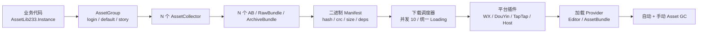
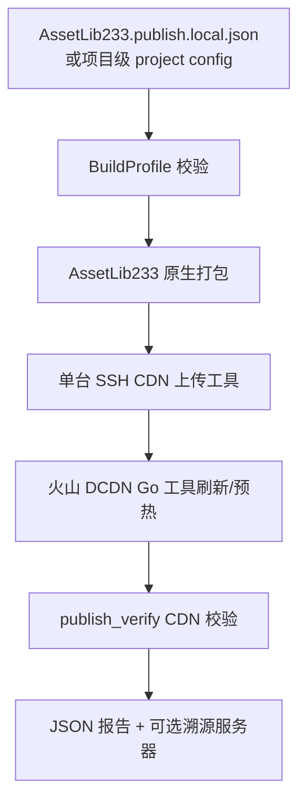
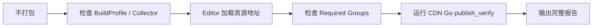

# AssetLib233-unity

独立 Unity / 团结引擎资源热更库。

文档首页: https://neko233-com.github.io/AssetLib233-unity/

仓库: https://github.com/neko233-com/AssetLib233-unity

目标：完全替代 YooAsset，优先服务微信小游戏 / WebGL / HybridCLR / 多 AssetGroup 热更场景。框架本体 0 依赖；UniTask 为可选插件；CDN 上传 / 刷新可接 Go 二进制、C# 工具或任意外部命令。

## 安装

UPM Git 一行安装：

```text
https://github.com/neko233-com/AssetLib233-unity.git
```

无 Git 导入，一行 PowerShell 下载到当前 Unity 项目：

```powershell
powershell -ExecutionPolicy Bypass -Command "iwr https://raw.githubusercontent.com/neko233-com/AssetLib233-unity/main/Tools/install-assetlib233.ps1 -OutFile $env:TEMP/install-assetlib233.ps1; & $env:TEMP/install-assetlib233.ps1 -ProjectRoot (Get-Location).Path"
```

核心模型：



- `AssetLib233.Instance`: 用户 facade 单例。
- `AssetGroup`: 顶层热更资源组。
- `AssetCollector`: 一个资源组内的收集器，决定资源如何切成 AB / RawBundle / ArchiveBundle。
- `AssetManifest`: 二进制清单，保存地址、标签、依赖、hash、crc、size。
- `Plugin_MiniGame_WX` / `Plugin_MiniGame_DouYin` / `Plugin_MiniGame_TapTap`: 小游戏平台插件。
- `Plugin_UniTask`: UniTask 扩展，Runtime 不强依赖 UniTask。
- `AssetLib233StartupPlan`: 一个 login 快速首组 + 登录后 N 个 AssetGroup。
- `AssetLib233AssetGcService`: 自动 Asset GC + 手动 Asset GC。
- `AssetLib233EditorPublishPipeline`: 打包、上传 CDN、刷新 CDN、报告、溯源的一条龙发布流水线。
- `IAssetLib233CdnProvider`: CDN 策略接口，内置火山引擎中国、阿里云、腾讯云、AWS、Custom，默认火山引擎中国。
- `AssetLib233CdnGoToolAdapter`: 原生适配现有火山 DCDN Go 工具配置目录，如 `_tools/cdn_douyin_tools`。
- `AssetLib233EditorAgentValidationPipeline`: 不打 AB 的 agent-first 验证，检查平台配置、Collector、地址、Editor 可加载性和已发布 CDN 文件。
- `AssetLib233EditorI18n`: 中英文日志/报告文案策略。
- `AssetLib233DownloadScheduler`: 单文件下载 + 多 AssetGroup 并发下载 + 统一 Loading。
- `IAssetLib233BuildCompressionStrategy`: 压缩策略接口。
- `IAssetLib233BuildPackRule`: 打包规则接口。
- `IAssetLib233BuildVerifier`: 打包产物校验接口，确认 AB / Manifest / hash / size 完整。
- `AssetLib233ObsoleteBundleCleaner`: 清理新版本不再使用的废弃 AB。
- `AssetLib233PreparePackageOperation`: `.version -> .manifest -> Manifest 注入` 主线程异步流程。
- `AssetLib233PackageDownloadOperation`: Manifest 就绪后全量 / tag 下载到本地 cache。
- `AssetController_AssetLib233`: 当前项目 `AssetManager233` 默认后端，业务代码不用改加载入口。

## 快速示例

```csharp
AssetLib233PackageConfig config = new AssetLib233PackageConfig();
config.PackageName = "default";
config.PlayMode = EnumAssetLib233PlayMode.Host;
config.DefaultHostServer = "https://cdn.example.com/default";
config.FallbackHostServer = "https://backup.example.com/default";

AssetLib233.Instance.Initialize();
AssetLib233.Instance.InitializeGroup(config);

AssetHandle233<GameObject> handle =
    AssetLib233.Instance.LoadAssetAsync<GameObject>("default", "ui/main.prefab");
```

## 异步支持

- callback: `operation.OnCompleted(...)`
- C# await: `await operation`
- UniTask: `await operation.ToUniTask()`

## 文档

纯 HTML 文档位于 `docs/`，可直接作为 GitHub Pages 使用：

- 首页：`docs/index.html`
- 快速上手：`docs/quickstart.html`
- 对比其他框架：`docs/comparison.html`
- 架构设计：`docs/architecture.html`
- 详细文档：`docs/manual.html`
- QA问题：`docs/qa.html`
- 联系我们：`docs/contact.html`

## .local 私密配置

复制 `Samples~/AssetLib233.publish.local.example.json` 到项目根目录：

```text
AssetLib233.publish.local.json
```

该文件用于配置本机 SSH、CDN、上传工具、刷新工具、溯源服务器，不提交 Git。也可用环境变量指定：

```powershell
$env:ASSETLIB233_LOCAL_CONFIG="D:/Private/AssetLib233.publish.local.json"
```

## Agent-first 发布



```powershell
powershell -ExecutionPolicy Bypass -File Assets/neko233/AssetLib233/Tools/agent-publish.ps1 -UnityPath "D:/Unity/Editor/Unity.exe" -ProjectRoot "D:/Project"
```

若 `.local` 配置了 `nativeBuildProfilePath`，发布流水线会先调用 AssetLib233 原生构建：

```json
{
  "nativeBuildProfilePath": "Assets/neko233/AssetLib233/AssetLib233BuildProfile.asset",
  "nativeBuildTarget": "WebGL",
  "buildOutputRoot": "D:/Build/AssetLib233",
  "cdnProvider": "VolcengineChina",
  "cdnRegion": "cn"
}
```

构建输出按 `buildOutputRoot/{AssetGroup}` 组织，每个组包含：

- `{group}.version`: `version|manifestFileName|manifestHash|manifestSize`
- `{group}.manifest`: AssetLib233 二进制 Manifest
- `*.ab`: AssetBundle 文件

发布完成后会在 `.local` 的 `reportRoot` 下生成独立报告 JSON，可回溯每次 build / upload / refresh 的命令、日志、退出码。

火山引擎中国默认支持直接指向项目内已有 Go 工具配置目录：

```json
{
  "cdnProvider": "VolcengineChina",
  "cdnGoToolConfigDirectory": "_tools/cdn_douyin_tools",
  "cdnGoToolConfigName": "config-for-douyin-refresh-cdn.minigame_wx_test.json",
  "cdnGoToolExecutableName": "douyin-refresh-cdn.exe",
  "cdnGoToolCommand": "run"
}
```

该 Go 配置可继续使用原来的 `publish_verify`，AssetLib233 会把命令、日志路径、退出码写进报告。

若配置了 `cdnTraceServerUrl`，发布报告会以 JSON POST 到溯源服务器。鉴权 token 从 `cdnTraceTokenEnvName` 指向的环境变量读取，不写入仓库。

## 性能原则

- 主线程异步 Tick，不引入线程、锁、并发容器。
- 多 AssetGroup 下载统一汇总一条 Loading。
- 默认下载并发 10，小游戏平台优先。
- 框架内部热路径使用 NonAlloc / ListPool。
- 稳定优先，不为了零 GC 牺牲可维护性和排障能力。

## 真机诊断

项目中可直接输出：

```csharp
string report = AssetManager233.Instance.BuildAssetLib233RuntimeDiagnosticString();
Debug.Log(report);
```

诊断串包含平台、并发、AssetGroup、Manifest、Bundle 本地路径、最近下载 / 加载事件，方便复制真机日志定位 AB 下载失败或资源为空。

## 免打包 Agent 验证



```powershell
powershell -ExecutionPolicy Bypass -File Assets/neko233/AssetLib233/Tools/agent-validate.ps1 -UnityPath "D:/Unity/Editor/Unity.exe" -ProjectRoot "D:/Project"
```

验证内容：

- BuildProfile 是否存在
- Required AssetGroup 是否存在
- Collector 根目录是否存在
- 收集到的资源地址是否重复
- 资源是否能在 Editor 被加载
- sample address 是否存在
- CDN Go 工具配置是否可运行
- 已发布 CDN 文件是否通过 Go 工具 `publish_verify`

`.local` 可配置：

```json
{
  "language": "zh-CN",
  "agentValidationBuildProfilePath": "Assets/neko233/AssetLib233/AssetLib233BuildProfile.asset",
  "agentValidationPlatform": "WX",
  "agentValidationEnvironment": "test",
  "agentValidationRequiredGroups": ["login", "default", "story"],
  "agentValidationSampleAddresses": []
}
```
